# Nova — Architecture

> Companion documents: [`README.md`](../README.md) (overview & setup),
> [`DETAIL.md`](DETAIL.md) (exhaustive module reference). Keep all three in sync
> when the system changes.

This document describes **how Nova is built**: its layers, the path a request
travels, the domain model, cross-cutting concerns, the frontend architecture,
and the key design decisions behind them.

## Contents

1. [System overview](#1-system-overview)
2. [Request lifecycle](#2-request-lifecycle)
3. [Clean Architecture layers (backend)](#3-clean-architecture-layers-backend)
4. [Module anatomy](#4-module-anatomy)
5. [Domain model](#5-domain-model)
6. [Data provenance & the "everything is enterable" rule](#6-data-provenance--the-everything-is-enterable-rule)
7. [Authentication & RBAC](#7-authentication--rbac)
8. [Integrations architecture](#8-integrations-architecture)
9. [AI integration (graceful degradation)](#9-ai-integration-graceful-degradation)
10. [Frontend architecture](#10-frontend-architecture)
11. [Frontend navigation map (sitemap)](#11-frontend-navigation-map-sitemap)
12. [Internationalization](#12-internationalization)
13. [Deployment](#13-deployment)
14. [Key design decisions](#14-key-design-decisions)

---

## 1. System overview

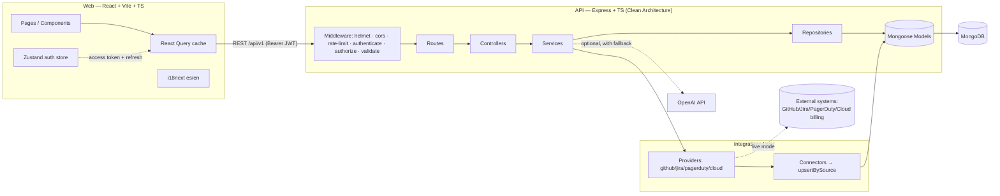

Nova is a **two-tier SPA + REST API** backed by MongoDB. The API is stateless
(JWT in the request, sessions persisted in Mongo), so it scales horizontally.
Optional outbound calls (OpenAI, external integrations) always degrade
gracefully.

## 2. Request lifecycle

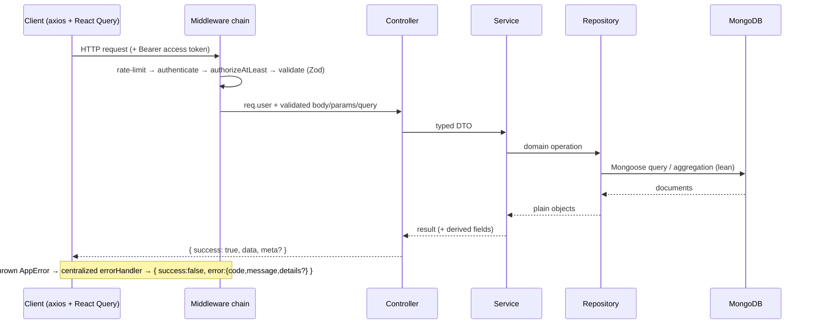

On `401` due to an expired access token, the axios client transparently calls
`POST /auth/refresh`, rotates the token pair, and retries the original request
once (see [Frontend architecture](#10-frontend-architecture)).

## 3. Clean Architecture layers (backend)

```
Routes        → wiring + per-route RBAC + Zod validation middleware
Controllers   → HTTP adapter (req/res), no business logic
Services      → business logic, derived metrics, orchestration, AI, integrations
Repositories  → data access (BaseRepository<T>: paginate / search / filter / sort / CRUD)
Models + DTOs → Mongoose schemas (persistence + derivation hooks) + Zod request DTOs
```

Dependencies point **inward**: `routes → controllers → services → repositories →
models`. Controllers never touch Mongoose; services never touch `req`/`res`.
Cross-cutting concerns (errors, auth, validation, logging, pagination parsing)
live in `shared/`.

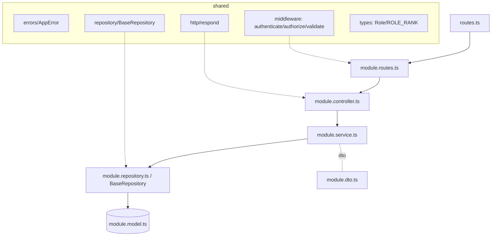

`BaseRepository<T>` provides uniform `paginate()` (with `page/limit/sort/search/
filters`), `findById`, `create`, `updateById`, `deleteById`, `count`, and
`aggregate()` across **18+ resources**, so list semantics are identical
everywhere.

## 4. Module anatomy

A feature module is a self-contained folder under `server/src/modules/<name>`:

```
<name>/
├── <name>.model.ts        # Mongoose schema(s) + indexes + derivation hooks
├── <name>.dto.ts          # Zod schemas for create/update/query + inferred types
├── <name>.repository.ts   # (optional) extends BaseRepository<T>; defines searchable fields
├── <name>.service.ts      # business logic, derived metrics, aggregations
├── <name>.controller.ts   # thin HTTP adapter using shared respond helpers
├── <name>.routes.ts       # router with authenticate + authorizeAtLeast + validate
└── <name>.service.spec.ts # (where applicable) unit tests for pure logic
```

`finance` additionally nests `models/` (nine cost schemas) and uses a generic
`mountCrud()` helper plus a `FinanceRepository<T>` to register all nine ledgers
with identical CRUD semantics. `integrations` follows the same shape but adds a
`providers/` (data source) and per-provider `connector/` (normalize + persist)
split — see [§8](#8-integrations-architecture).

## 5. Domain model

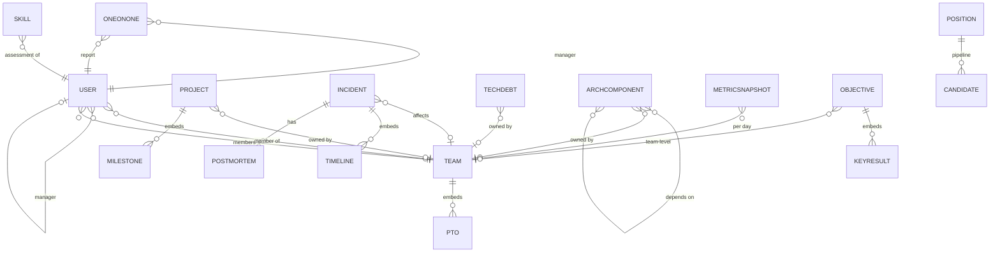

### Finance sub-domain

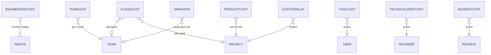

Field-level definitions, enums and derived formulas for every entity are in
[`DETAIL.md`](DETAIL.md).

### Consolidated entity map

A single-glance view of every persisted entity and how it links to the people/
team backbone (consolidates the two diagrams above and adds the engagement
domain). Embedded sub-documents are shown as owned children.

```mermaid
erDiagram
  TEAM ||--o{ USER : "members"
  USER ||--o| USER : "manager"
  TEAM ||--o{ PTO : "embeds"
  USER ||--o{ SKILL : "assessed in"
  USER ||--o{ COMPENSATION : "has"
  TEAM ||--o{ PROJECT : "owns"
  PROJECT ||--o{ MILESTONE : "embeds"
  TEAM ||--o{ INCIDENT : "affects"
  INCIDENT ||--o{ TIMELINE : "embeds"
  INCIDENT ||--o| POSTMORTEM : "has"
  TEAM ||--o{ TECHDEBT : "owns"
  TEAM ||--o{ ARCHCOMPONENT : "owns"
  ARCHCOMPONENT ||--o{ ARCHCOMPONENT : "depends on"
  USER ||--o{ ONEONONE : "manager/report"
  TEAM ||--o{ METRICSNAPSHOT : "daily DORA"
  TEAM ||--o{ OBJECTIVE : "team OKRs"
  OBJECTIVE ||--o{ KEYRESULT : "embeds"
  TEAM ||--o{ POSITION : "headcount"
  POSITION ||--o{ CANDIDATE : "pipeline"
  TEAM ||--o{ ENGAGEMENTRESPONSE : "eNPS pulse"
  TEAM ||--o{ TEAMCOST : "monthly cost"
  PROJECT ||--o{ PRODUCTCOST : "monthly cost"
  TEAM ||--o{ CLOUDCOST : "allocated"
  USER ||--o{ TOOLCOST : "owns"
  TECHDEBT ||--o{ TECHNICALDEBTCOST : "priced by"
  INCIDENT ||--o{ INCIDENTCOST : "priced by"
  PROJECT ||--o{ COSTOFDELAY : "feature delay"
  TEAM ||--o{ HIRINGROI : "proposed role"
  ENGINEERINGCOST }o--o{ MONTH : "monthly ledger"
```

### Finance cost data flow

How finance numbers travel from **enterable source ledgers** (plus the cloud
integration) through aggregation services to the read-only dashboards and pages —
and how an edit instantly refreshes the derived views via React Query
invalidation.

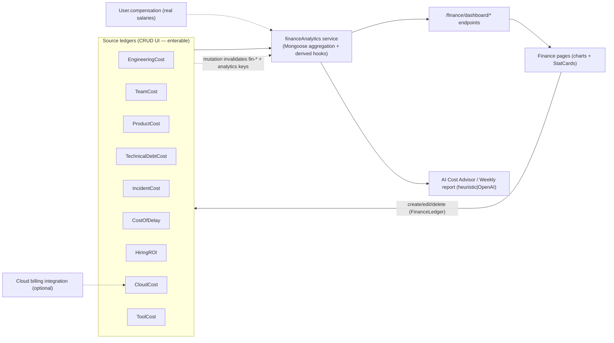

## 6. Data provenance & the "everything is enterable" rule

A defining product constraint: **every value Nova renders must originate inside
the product** — entered via a form, or ingested via an integration. Nothing is
seed-only. Three data classes:

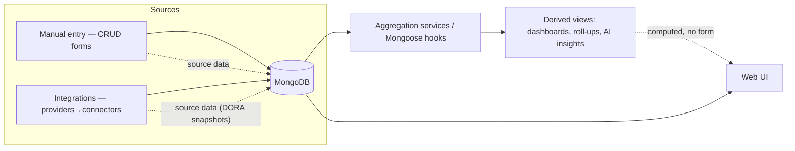

| Class | Examples | Has a form? |
| --- | --- | --- |
| **Source — manual** | users, teams, projects, incidents, tech debt, architecture, OKRs, 1:1s, positions, candidates, skill catalog, skill assessments, all 9 finance cost ledgers | ✅ yes |
| **Source — integration** | DORA metric snapshots (GitHub) | via integration sync |
| **Derived** | Executive dashboard, OKR roll-up, delivery forecast, people/retention dashboards, finance analytics, AI insights | ❌ computed |

When adding a screen, classify its data first: if it shows **source** data,
it must have a create/edit path; if it shows **derived** data, ensure the inputs
it derives from are themselves enterable. The reusable
`web/src/components/finance/FinanceLedger.tsx` exists to make adding a source
ledger UI a few lines of config.

## 7. Authentication & RBAC

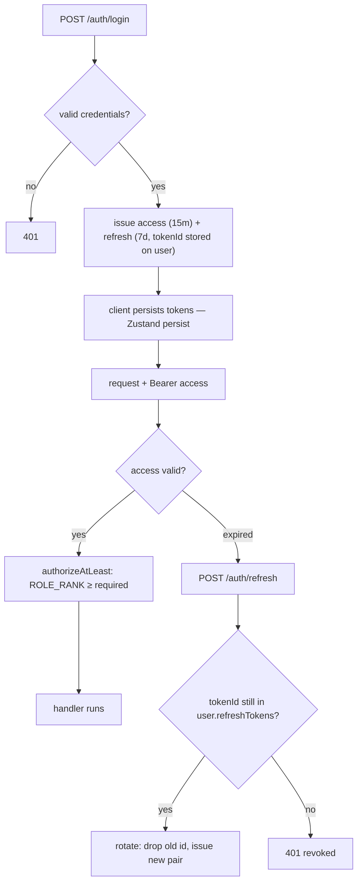

- **Role rank**: `admin 100 > cto 90 > head_of_engineering 80 > engineering_manager 60 > engineer 30 > viewer 10` (`shared/types`).
- **`authorizeAtLeast(role)`** admits any caller whose rank ≥ the named role.
- **Refresh rotation**: each refresh token carries a `tokenId` stored on the
  user; refreshing drops the used id and issues a new pair. Capped at **5 active
  sessions**; logout and password change revoke all.
- **Scoped reads**: compensation and 1:1 `privateNotes` are only returned to
  leadership / the owning manager / the subject.

## 8. Integrations architecture

The integrations layer cleanly separates **where data comes from** (provider)
from **how it is normalized and stored** (connector), so a dummy data source can
be swapped for a real API without touching the rest of the system.

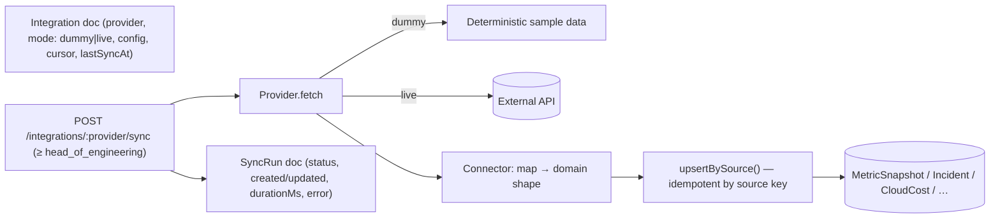

- **Providers** (`integrations/providers/*.provider.ts`): `github`, `jira`,
  `pagerduty`, `cloud`. Each returns normalized records; in `dummy` mode they
  return deterministic samples (no network), in `live` mode they would call the
  real API with stored config/tokens.
- **Connectors** (`integrations/<provider>/<provider>.connector.ts`): map
  provider output to domain models and persist via `upsertBySource()`, which is
  idempotent on a `source` key so re-syncs don't duplicate.
- **GitHub → `MetricSnapshot`** feeds the DORA trend charts and delivery
  forecast. This is how the Dashboard's operational metrics enter the system
  without a manual form.
- **`SyncRun`** records each sync's outcome for observability.

Full connector/provider guide: [`INTEGRATIONS.md`](INTEGRATIONS.md).

## 9. AI integration (graceful degradation)

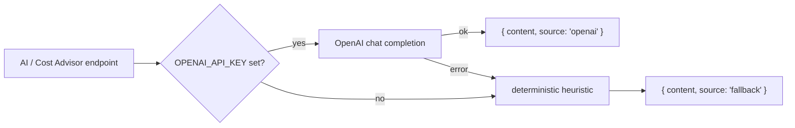

Every AI service is built around `complete(system, user, fallback)`. The
platform is fully functional without an API key (CI, local, offline) and never
fails a request because of an upstream outage. Responses are tagged with their
`source` so the UI can badge "OpenAI" vs "heuristic mode".

## 10. Frontend architecture

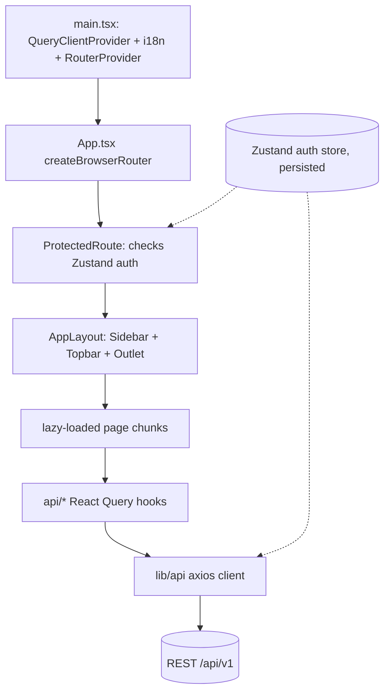

- **Routing**: `react-router-dom` with `createBrowserRouter`. Every page is
  `lazy()`-loaded → small initial bundle, one chunk per screen. All app routes
  sit behind `ProtectedRoute` → `AppLayout`.
- **Data fetching**: `@tanstack/react-query`. Query keys are stable per resource
  (`['okrs', params]`, `['fin-team-costs', {page}]`, …). Mutations invalidate the
  relevant list key **and** any derived dashboard key so analytics recompute
  (e.g. a TeamCost edit invalidates `fin-teams` and `fin-exec`).
- **API client**: a single `axios` instance (`lib/api.ts`) injects the Bearer
  token, normalizes errors via `apiError()`, and performs the transparent
  refresh-and-retry on `401`.
- **Auth state**: a persisted `zustand` store holds `user`, `accessToken`,
  `refreshToken`. `lib/permissions.ts` exposes `useCan(role)` for RBAC-aware UI.
- **UI system**: Tailwind + `class-variance-authority` primitives in
  `components/ui/*` (Button, Input, Select, Dialog, Table, Card, Badge…),
  composed by shared pieces in `components/shared/*` (PageHeader, StatCard,
  States, Pagination, RowActions, ConfirmDelete) and charts in
  `components/charts/*` (Recharts wrappers).
- **Forms pattern**: list + dialog with `useState` form, build body (coerce
  numbers, omit empty optional FKs), `mutateAsync`, surface `apiError`. The
  `FinanceLedger` component generalizes this for cost ledgers via a declarative
  field/column config.

## 11. Frontend navigation map (sitemap)

The information architecture as rendered by the sidebar
(`web/src/components/layout/Sidebar.tsx`): a flat top group plus three
collapsible sections (People & Org, Delivery, Finance), with Integrations and
Settings pinned at the bottom. **E** = screen where source data is entered;
**D** = derived/read-only view (computed from enterable inputs); **I** = fed by
an integration. The hidden AI Insights route still exists but is not shown in
the menu.

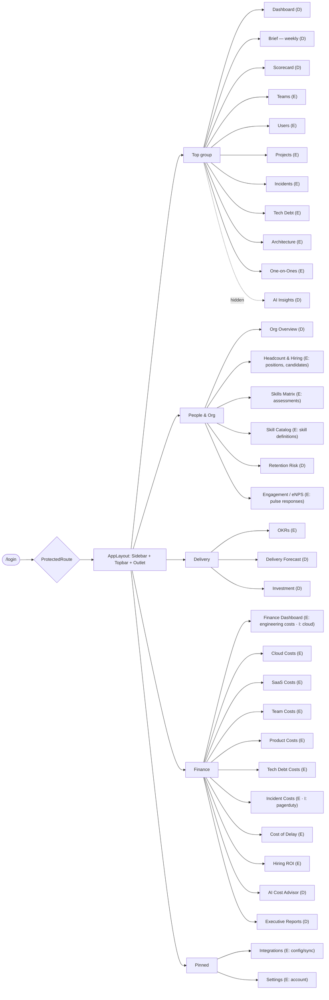

> Routes are declared in `web/src/App.tsx` (all lazy-loaded, behind
> `ProtectedRoute → AppLayout`). The per-route data source and entry capability
> are tabulated in [`DETAIL.md` → Frontend reference](DETAIL.md#frontend-reference).

## 12. Internationalization

`i18next` + `react-i18next` with two locales in `web/src/i18n/locales/{es,en}.ts`,
sharing an identical key tree (`nav`, `common`, `pages`, plus per-domain
namespaces like `finance`, `skills`, `org`, `okrs`). Components read strings via
`t('namespace.key')`. **Both locales must define every key**; demo/seed content
is authored in Spanish.

## 13. Deployment

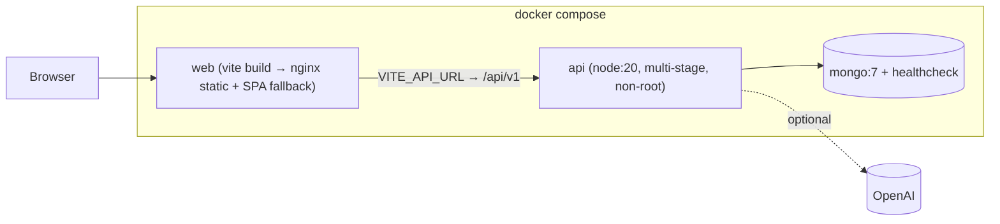

- **API image**: multi-stage (build → slim runtime, runs as non-root `node`).
- **Web image**: Vite build served by nginx with SPA fallback + asset caching.
- **Health probe**: `GET /health` (used by compose healthchecks / orchestrators).
- **Horizontal scaling**: the API is stateless (JWT); sessions live in MongoDB,
  so any instance can serve any request.

## 14. Key design decisions

| Decision | Rationale |
| --- | --- |
| `BaseRepository<T>` generic | Uniform pagination/search/filter/sort/CRUD across 18+ resources |
| Derived fields via Mongoose hooks | Scores/costs computed consistently on create **and** update, never trusting the client |
| Zod DTOs at the edge | One validation source of truth; handlers receive typed, safe input |
| Provider/connector split for integrations | Swap dummy data for a real API without touching domain code; idempotent `upsertBySource` |
| Heuristic AI fallback | Product works without OpenAI; deterministic, testable, outage-proof |
| Feature-folder modules | Each domain is self-contained (model→dto→repo→service→controller→routes) |
| "Everything is enterable" rule | Nova is operable end-to-end, not a read-only viewer of seed data |
| Reusable `FinanceLedger` | New source-data UIs are declarative config, not copy-paste |
| Lazy-loaded routes (web) | Small initial bundle; each page is a separate chunk |
| Mutation → derived-key invalidation | Editing source data instantly refreshes dependent dashboards |
| Bilingual from day one | es/en parity enforced in a shared key tree |
